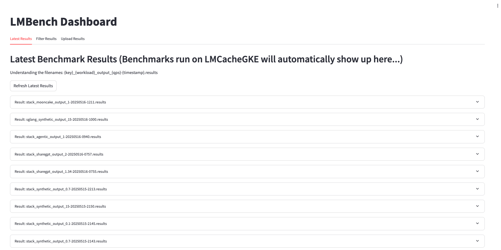
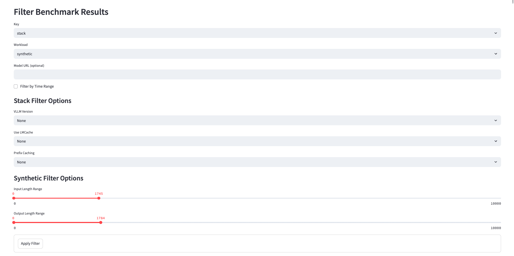
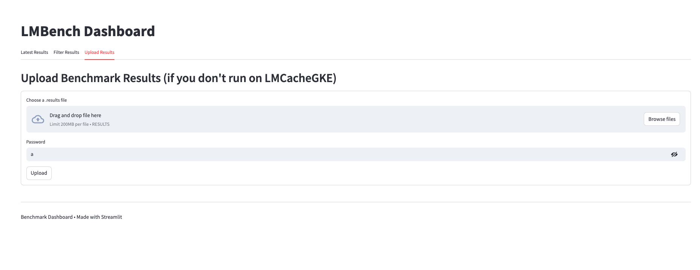

# LMBench: Kubernetes-based Online Benchmarking.

## [Dashboard (lmbench.dev)](https://lmbench.dev/) to view/filter and submit latest results (if you run locally, if you run on the LMCache Runner, results will automatically show up).

# Running Benchmarks

### **Step 1:**

Write out your `bench-spec.yaml` with what Infrastructure, Serving Baseline, and Workload you are using. Reference `bench-spec-TEMPLATE.yaml` for configuration.

### **Step 2:**

**Option 1 (Recommended):** Submit a PR (or directly push if you have access) to LMCache/LMBench. You must have `Location: LMCacheGKE` set. There is only a single runner so your benchmark job may be queued.

**Option 2:** Clone to run on your local machine. You must have `Location: LocalMinike` set. Dependencies for local installation are in `requirements.txt`